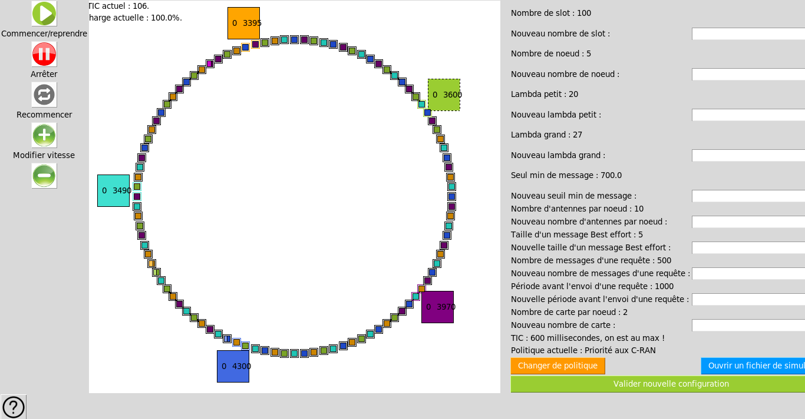

# Simulateurs N-GREEN

Ce dépôt contient deux projets de simulateur réalisés dans le cadre de mon stage de fin de DUT effectué dans le laboratoire David de l'Université de Versaille Saint-Quentin-en-Yvelines.

## Simulateur graphique (Python 2.7)

### Pré-requis

Installer Python ainsi que le module Tkinter (package 'python-tk')
```
apt-get install python python-tk
```

Installer La bibliotheque de traitement d'image de Python (Python Imaging Library)
```
pip install Pillow
```

### Usage

Aller dans le répertoire : simulation_graphique/script
Executer le fichier "simulation_v2.py"
```
cd simulation_graphique/script
python simulation_v2.py
```

Voici ce à quoi ressemble le simulateur durant son execution


## Simulateur optimisé (C)

### Pré-requis
Installer le language R (utilisé pour la gestion des statistiques du simulateur)
```
apt-get install r-base
```

Installer le package ggplot2 sur R.
Depuis un terminal R entrez : install.packages('ggplot2')
```
install.packages('ggplot2')
```

Installer le lecteur PDF evince (Pour afficher les graphiques)

## Auteurs

* **Karim Ghallab** (https://github.com/KarimGhallab)

## Remerciments

Un grand remerciment à Mael et Yann pour m'avoir guider pendant tous le long de ce stage !

* ** Yann-Strozecki ** (https://github.com/yann-strozecki)
* **Mael Guiraud** (https://github.com/Mael-Guiraud)
